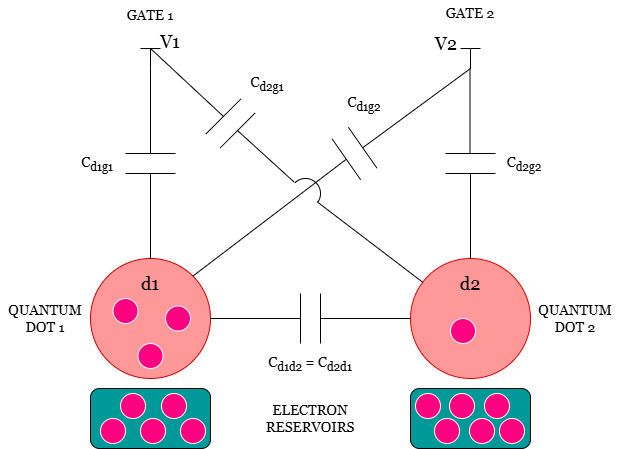

# Double Quantum Dot Charge Stability Diagram

This repository contains a simple numerical model of a double quantum dot (DQD) system, with the goal of reproducing its charge stability diagram.

## Overview

Double quantum dots are nanoscale systems where electrons can be confined in two coupled potential wells. Their charge configuration depends on external gate voltages and electrostatic interactions.

This notebook computes the ground-state charge configuration as a function of gate voltages and visualizes the resulting charge stability diagram.

## System

*Figure 1: Schematic representation of the Double Quantum Dot (DQD) circuit.*

## Features

- Implementation of a classical electrostatic model for a DQD
- Calculation of charge configurations
- Visualization of the charge stability diagram
- Reproduction of the characteristic honeycomb pattern

## Result

*Figure 2: Charge stability diagram showing the characteristic honeycomb structure.*

## File

- `dqd_charge_stability_diagram.ipynb`: main notebook with explanation, code, and results

## Motivation

This project is based on a past interview problem, which I reworked and extended independently to better understand the physics of double quantum dots and improve my numerical skills.

## Requirements

- Python 3
- NumPy
- Matplotlib

## Output

The main result is the charge stability diagram, showing the expected honeycomb structure typical of DQD systems.